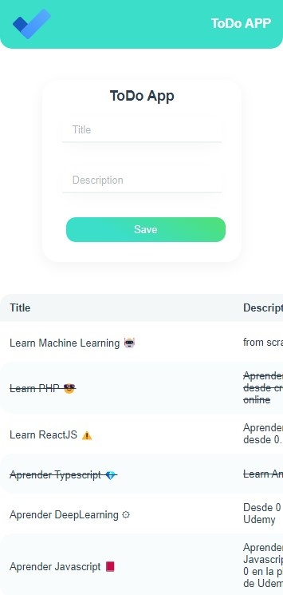
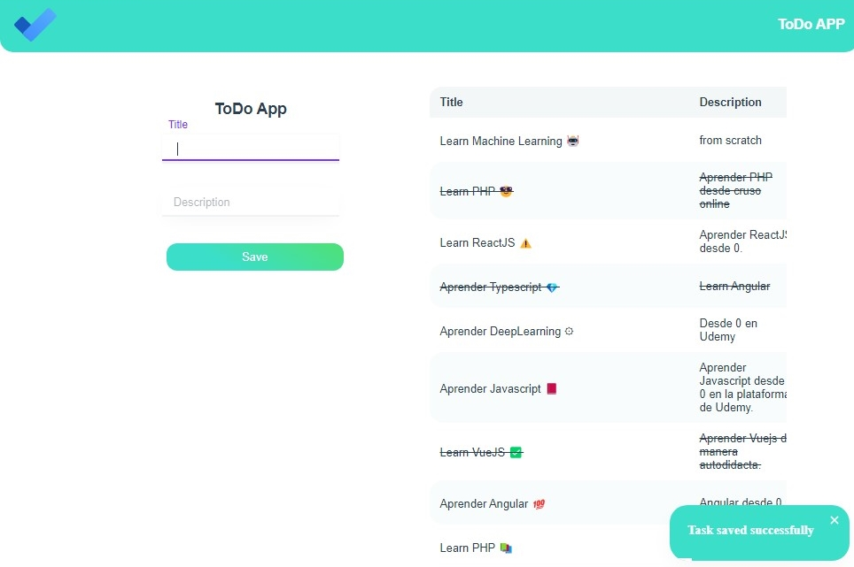
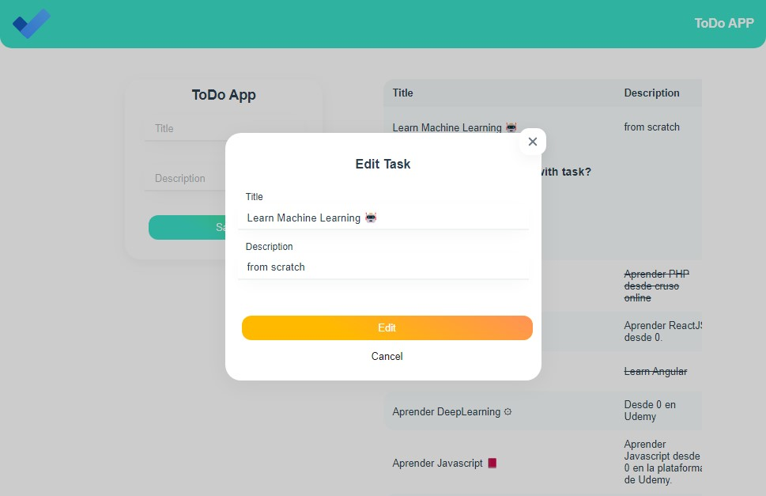
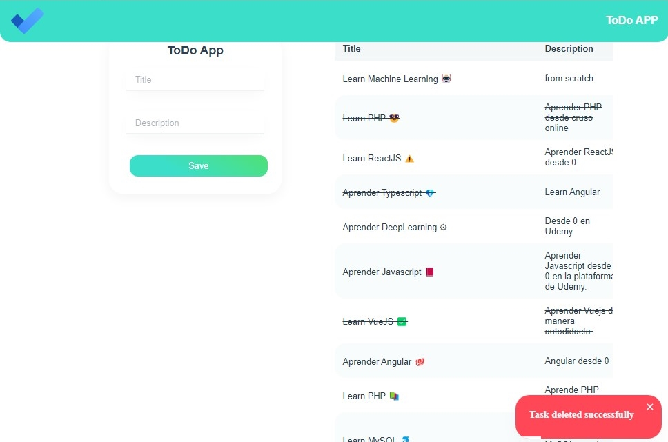

# Todo APP CRUD API with VueJS 🚀 

## Table of Content

- [About The Project](#about-the-project)
  - [Description](#description)
  - [Built With](#built-with)
- [Installation](#installation)
- [Usage](#usage)
- [Demo](#demo)
- [Contact](#contact)

## About The Project






## Description

This project is for a full CRUD of a task app.
For the application to perform the CRUD operations, it must do so through requests to an [API that I made with Flask](https://github.com/josemiguel02/my-api-rest-flask), also to make these requests I used the Axios library and for the UI I used Vuesax.

## Built With

[](https://vuejs.org)

<a href='https://axios-http.com'>
  
</a>

<a href='https://vuesax.com'>
  
</a>

## Installation

1. Clone the repo and change "my-project" to your project name.

```sh
  git clone https://github.com/josemiguel02/crud-api-todo-app.git ./my-project
```

2. Go to the project directory

```sh
  cd my-project
```

3. Install NPM packages

```sh
  npm install
```

## Usage

Run the project in development

```npm
  npm run serve
```

Build the project

```npm
  npm run build
```

## Demo

- [View demo](https://4c5f8f1b.crud-api-todo-app.pages.dev)

## Contact

- Gmail - [josemidev24@gmail.com](mailto:josemidev24@gmail.com)
- Instagram - [@jmdp.02](https://www.instagram.com/jmdp.02)
